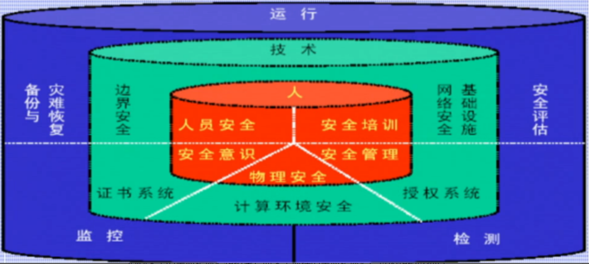
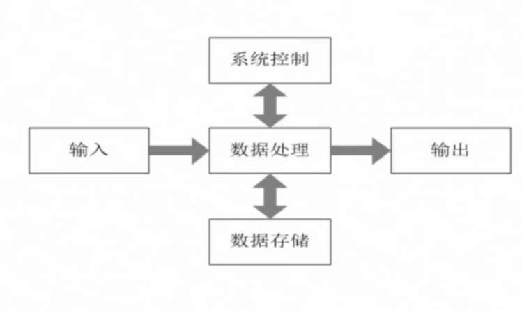
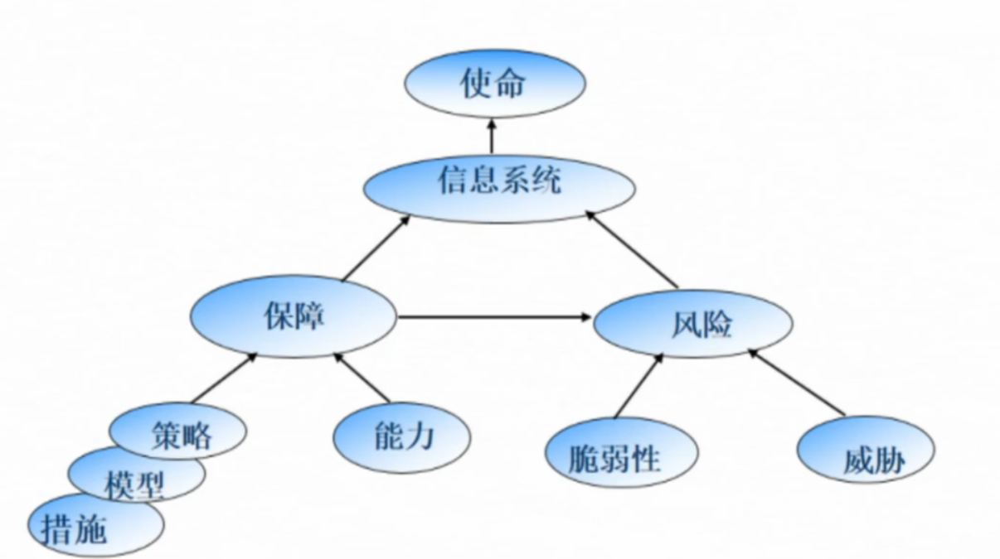
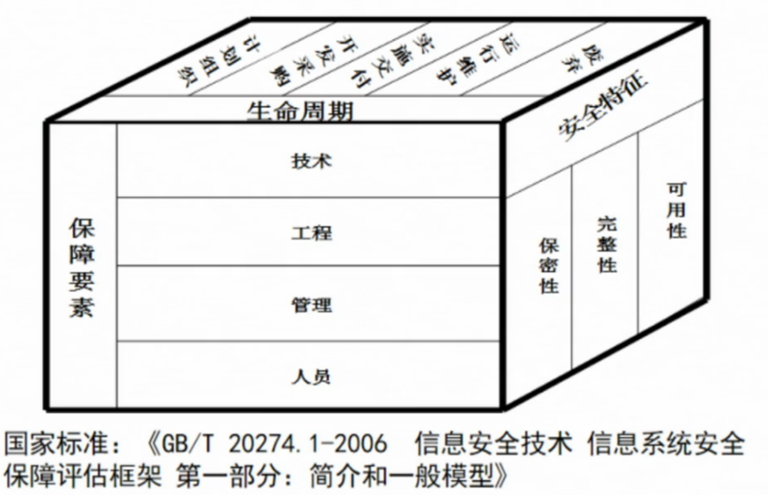

# 信息安全概述

## 信息与信息安全

### 信息的概念

* 信息奠基人香农(C. E. Shannon)认为:信息是用来消除随机不确定性的东西。
* 信息是事物运动状态或存在方式的不确定性的描述。
* 信息是具体的，并且可以被人(生物、机器等)所感知、提取、识别，可以被传递、储存、变换、处理、显示检索和利用。
* 信息来源于物质，又不是物质本身;它从物质的运动中产生出来，又可以脱离源物质而寄生于媒体物质，相对独立地存在。
### 信息的定义
信息是有意义的数据，它具有一定价值，是一种需要适当保护的资产。
数据是反映客观事物属性的记录，是信息的具体表现形式。数据经过加工处理之后，  就成为信息;而信息需要经过数字化处理转变成数据才能存储和传输。

### 信息的功能

反映事物内部属性、状态、结构、相互联系以及与外部环境的互动关系，减少事物的不确定性。

### 信息的表达
      信息本身是无形的，借助于信息媒体以多种形式存在或传播。它可以存储在计算机、磁带、纸张等介质中，也可以记忆在人的大脑里，还可以通过网络等方式进行传播。

### 信息与消息的区别
消息是信息的外壳，信息是消息的内核，也可以说：消息是信息的笼统概念，信息则是消息的精确概念。

### 信息与数据的区别
数据是信息的符号表示，或称载体；信息是数据的内涵，是数据的语义解释。数据是信息存在的一种形式，只有通过解释或处理才能成为有用的信息。数据可用不同的形式表示，而信息不会随数据的不同形式而改变。

信息技术

信息技术是用于管理和处理信息所采用的各种技术的总称。
* 主要是利用计算机科学和通信技术来设计、开发、安装和实施信息系统及应用软件。
* 信息处理是获取信息并对它进行变换，使之成为有用信息并发布出去的过程，主要包括对信息的获取、加工、发布和表示等环节。
* 目前，信息搜集和处理已经成为人们社会工作的一个重要组成部分。

信息技术包括生产和应用两个方面：
* 信息技术生产主要体现在信息技术产业本身，包括计算机软件、计算机硬件、设备制造、微电子电路等；
* 信息技术应用体现在信息技术的扩散上，包括信息服务、信息管理系统等。

微电子、通信、计算机和网络是信息系统的核心技术，其发展进程可大致分为以下四个阶段：
* 第一阶段：电讯技术的发明
  * 信息技术的起源可追溯到19世纪30年代，其标志性事件是电话电报的出现。
  * 1835,美摩尔斯发明电报；
  * 1837，摩尔斯电磁式有线电报问世；
  * 1886，马可尼发明无线电报机；
  * 1876，贝尔发明电话机；
  * 1906，美费森登研究出无线电广播；
  * 1912，美emersong公司制作出第一台收音机；
  * 1925，贝德发明第一台电视机
* 第二阶段：计算机技术的发展
  * 20世纪30年代进入计算机阶段；
  * 20世纪50年代，第一代电子管计算机，用于军事科研信息处理；
  * 60年代中期，第二代晶体管计算机民用化；
  * 60年代末，集成电路出现
* 第三阶段：互联网的使用
  * 20世纪60年代末，美国ARPANET用于军事目的；
  * 20世纪90年代，发展成为因特网
* 第四阶段：网络社会

### 信息安全
* 信息安全一般指信息系统（包括硬件、软件、数据、人、物理环境及其基础设施）受到保护，不受偶然的或者恶意原因的影响而遭受到破坏、更改、泄露，系统连续可靠正常地运行，信息服务不中断，最终实现业务连续性。
* 信息安全的根本目的是使信息不受内部、外部、自然等因素的威胁。
* 所谓信息安全就是关注信息本身的安全，而不管是否应用了计算机作为信息处理的手段。
* 在我国信息安全标准化委员会发布的GB/T 25069-2010《信息安全技术术语》中，信息安全是指保持、维持信息的保密性、完整性和可用性，也可包括真实性、可核查性、抗抵赖性和可靠性等性质。

### 信息安全的目标
保证信息上述安全属性（保密性、完整性和可用性等）得到保持，不被破坏，从而对组织业务运行能力提供支撑。

### 信息安全的任务
保护信息资产（信息及信息系统）免受未经授权的访问使用、披露、破坏、修改、查看、记录及销毁。

### 信息安全的属性
基本属性：完整性、机密性、可用性。
其他属性：真实性、可控性、不可否认性。

**从消息的层次来看**，信息安全的属性有：
机密性：也称保密性，控制信息资源的开放范围，确保信息在存储、使用、传输过程中不会泄露给非授权用户、实体和进程，或被其利用；
完整性：确保信息在存储、使用、传输过程中保持未经授权不能改变的特性，即对抗主动攻击，保持数据一致，防止数据被非法用户修改和破坏；
不可否认性：又称抗抵赖性，即建立有效的责任机制，防止用户否认其发生信息的行为和信息的内荣。

**从网络的层面来看**，信息安全的属性有：
可用性：确保授权用户、实体和进程对信息及资源的正常使用不会被不合理拒绝，允许其可靠而即使地访问信息及资源。
可控性：对信息的传播范围及内容具有控制能力，防止非法利用信息和信息系统。

**信息的其他特征：**
相对性：安全是相对的、动态的，没有绝对安全的系统。
时效性：安全不能一劳永逸，需要根据安全风险，及时制定应对策略。
相关性：在更改配置等操作时。需要对系统重新进行评估和同步更新安全措施。
不确定性：攻击发起的时间、地点、攻击者和攻击目标都具有不确定性。
复杂性：信息安全是一项系统工程，涉及到安全管理、教育、培训、立法、国际合作等领域。

**与传统安全相比，信息安全具有4个鲜明特征**：
系统性：系统地从技术、管理、工程和标准法规等各层面综合保障的信息安全
动态性：对信息安全不能抱有一劳永逸的思想，应该根据风险的变化，在信息系统的整个生命周期中采用相应的安全措施来控制风险
无边界性：信息安全系统安全微信超越了现实地域和实现行业的限制
非传统性：与军事安全、政治安全等传统安全相比，信息安全涉及的领域和影响范围十分广泛

### 信息系统安全
信息系统安全包括：
* 数据安全（数据的秘密性、真实性、完整性 ）
  * IBM定义：采取措施确保数据免受未授权的泄露、篡改和毁坏
* 内容安全
  * 在法律、政治、道德层次上的要求，政治上健康、符合国家法律法规、符合中华民族美德)
* 信息设备（软设备、硬设备）的安全：信息系统安全的首要问题。
  * 设备的稳定性、可靠性、可用性
* 行为安全：信息安全的终极目的。（行为的秘密性、完整性、可控性）
  * 符合哲学上实践是检验真理的唯一标准原则

## 信息安全威胁

### 我国面临的信息安全3类威胁

- 国家威胁
  - 恐怖组织
  - 邪教组织
  - 西方势力
  - 其他国家情报机构

- 组织威胁
  - 主要针对企业或组织受保护的财产、专有技术
  - 具体表现：网络恐怖分子破坏公共秩序等；商业间谍打击竞争对手

- 个人威胁
  - 对知识产权的威胁
  - 侵犯、破坏个人计算机系统中的信息

### 信息安全问题产生的根源

#### 内因

- 系统自身的脆弱性
- 内在结构复杂性，容易导致问题。
- 凡是人做的东西总会存在问题
- 比如员工、移动介质、远程用户、访问网络等。

#### 外因

- 人为威胁
  - 国家安全威胁：信息战士、情报机构
  - 组织威胁：恐怖分子、商业间谍、犯罪团伙
  - 局部威胁：社会型黑客、娱乐型黑客

- 环境威胁
  - 雷击、地震、火灾等自然灾害
  - 电力、空调被电磁脉冲破坏
  - 信息系统机房和设备受破

## 信息安全发展阶段与形势

### 信息安全发展的四个阶段

- 第一阶段：通信安全
  - 时间：20世纪40-70年代
  - 核心思想：通过密码技术解决通信保密，保证数据的完整性和保密性；主要关注传输过程中的数据保护
  - 安全威胁：搭线窃听，密码学分析
  - 安全措施：加密

- 第二阶段：计算机安全
  - 时间：20世纪70-90年代
  - 核心思想：确保信息系统的保密性、完整性和可用性
  - 安全威胁：非法访问、恶意代码、弱口令等
  - 安全措施：安全操作系统设计技术

- 第三阶段：信息系统安全
  - 时间：20世纪90年代后
  - 核心思想：确保信息在存储、处理和传输过程中免受偶然或恶意的泄密、非法访问或破坏
  - 安全威胁：网络入侵、病毒破坏、信息对抗等
  - 安全措施：防火墙、防病毒、端口扫描、入侵检测、PKI、VPN等

- 第四阶段：信息安全保障
  - 时间：今天到将来
  - 核心思想：动态安全，保障信息系统的业务正常，稳定的运行；综合技术、管理、过程、人员
  - 安全威胁：黑客、恐怖分子、信息战、自然灾难、电力中断等
  - 安全措施：技术安全保障体系、安全管理体系、人员意识/培训/教育

### 信息安全形势

- 2013年，“棱镜门”事件
- 黑客攻击等

## 信息安全保障

### 信息安全保障含义

- 信息安全保障是指采用技术、管理等综合手段，保护信息和信息系统能够安全运行的防护性行为。

- 它通过保证信息和信息系统的可用性、完整性、机密性和不可否认性来保护并防御信息和信息系统的操作，包括通过综合保护、检测和响应等能力为信息系统提供修复。

### 信息安全保障具体行为或工作

- 防止信息泄露、修改和破坏

- 检测入侵行为，计划和部署针对入侵行为的防御措施

- 采用安全措施和容错机制在遭遇攻击的情况下保证机密性、私密性、完整性、抗抵赖性、真实性、可用性和可靠性

- 修复信息和信息系统所遭受的破坏

### 信息安全保障是一种立体保障

### 信息安全保障与信息安全、信息系统安全的区别

信息安全保障的概念更加广泛。

- 信息安全的重点是保护和防御，而安全保障的重点是保护、检测和响应综合

- 信息安全不太关注检测和响应，但是信息安全保障非常关系这两点

- 攻击后的修复不在传统信息安全概念的范围之内，但是它是信息安全保障的重要组成部分

- 信息安全的目的是为了防护攻击的发生，而信息安全保障的目的是为了保证信息系统始终能维持特定水平的可用性、完整性、真实性、机密性和抗抵赖性

### 信息安全保障模型

信息安全保障模型能准确描述安全的重要方面于系统行为的关系，提高对成功实现关键安全的理解层次，计划——执行——检查——改进（PDCA）模型和信息保障技术框架是信息安全管理和信息安全保障技术实施过程遵循的方法和思想。

2种信息安全保障模型

- 防护——检测——响应（PDR）模型
  - 基本思想：承认信息系统中存在漏洞，正视系统面临的威胁，通过适度防护并加强检测，落实安全事件响应，建立威胁源威慑，保障系统安全。
  - 该模型任务，任何安全防护措施都是基于时间的，超过该时间段，这种防护就可能被攻破。
  - PDR模型直观、实用，但对系统的安全隐患和安全措施采取相对固定的假设前提，难以适应网络安全环境的快速变化

- 策略——防护——检测——响应（P2DR/PPDR）模型
  - 核心：信息系统所有防护、检测和响应都是依据安全策略实施的

### 信息安全保障的重要性

- 由于网络信息传播的开放性、跨界性、即时性、交互性等特点，互联网在为广大民众提供越来越多有益信息及其他信息服务的同时，也存在着一你在全保明标型  些虚假和错误导向的信息，以及直接危害公众利益、民族团结、国家统一、社会稳定和国家安全的违法与有害信息及活动。构建更加安全可靠、更加有用、更加可信的互联网，服务于建设小康社会和构建和谐社会，是我国加强信息安全保障的一个重要任务。
- 在实施国家信息化发展战略中，要高度重视信息安全保障体系建设，实现信息化与信息安全协调发展
- 国家基础信息网络、重要信息系统以及政府，企业和公民的信息活动的安全若不能得到切实保障，信息化带来的巨大经济与社会效益就难以有效发挥，信息化发展也会受到严重制约
- 加强信息安全保障的目的，就是要保障和促进信息化发展，而不是以牺牲信息化发展来换取信息安全
- 构件更加安全可靠、更加有用、更加可信的互联网，服务于建设小康社会和构件和谐社会，是我国加强信息安全保障的一个重要任务
- 由于网络信息传播的开放性、跨界性，即时性、交互性等特点，在获取大量信息的同时，也存在着一些虚假和错误导向的新闻信息
- 为有效开展互联网治理工作，积极促进互联网发展，并依法进行管理，鼓励行业自律和公众监督，旨在形成一个可信和安全的互联网信息空间
- 采取不上网、不共享、不互通互联等封闭的方式保护安全，会严重影响信息化的发展，不能从根本上解决问题
- 只有大力推动信息化建设，全面提高信息化发展水平，才能为应对各种信息安全问题提供强有力的物质和技术保障
- 全面推进信息化，高度重视信息安全保障建设，才能形成健康有序、安全稳定的信息网络秩序

## 信息系统安全保障

### 信息系统是什么

信息系统是具有集成性的系统，每一个组织中信息流动的总和构成一个信息系统。信息系统是根据一定的需要进行输入、系统控制、数据处理、数据存储与输出等活动而涉及到的所有因素的综合体。

### 信息系统安全保障的含义

信息系统安全保障是在信息系统的整个生命周期中，从技术、管理、工程和人员等方面提出安全保障要求，确保信息系统的保密性、完整性和可用性，降低安全风险到可接口的程度，从而保障系统实现组织机构的使命。

### 关系图

#### 风险

信息安全风险产生的因素主要是有信息系统自身存在的漏洞和来自系统外部的威胁。信息系统运行环境中存在具有特定威胁动机的威胁源，通过使用各种攻击方法，利用信息系统的各种脆弱性，对信息系统造成一定的不良影响，由此引发信息安全事件和问题。

#### 保障

为了降低信息安全风险，信息安全保障就是针对信息系统在运行环境中所面临的各种风险，制定信息安全保障策略，在策略指导下，设计并实现信息安全保障架构或模型，采取技术、管理等安全保障措施，将风险控制到可接受的范围和程度，从而实现其业务使命。

#### 使命

描述了信息系统从设计、开发、测试、部署、维护、废弃整个生命周期中运行的需求和目标。信息系统的使命与其安全保障密不可分，需要随着信息系统安全措施来保障目标正确执行。随着信息系统面临的威胁及运行环境的变化，安全保障也需要提供响应的保障措施，从而保障信息系统的正确运行。

### 信息系统安全保障模型

