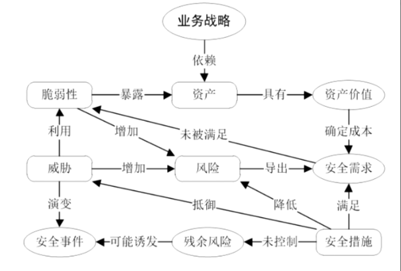

# 信息安全管理

## 信息安全管理概述

### 概念

信息安全管理使管理者为实现信息安全目标而进行计划、组织、指挥、协调和控制的一些列活动

### 作用/目的

保障组织的业务正常运行。

### 怎么做

1. 组织的活动能够反映组织的业务目标
2. 组织所有级别的管理者能够给予信息安全实质性的、可见的支持和承诺
3. 组织的管理者对信息安全需求、信息安全风险、风险评估及风险管理有正确的理解
4. 向所有管理者、员工和其他相关方提供有效的信息安全宣传以提升信息安全意识
5. 向所有管理者、员工和其他相关方分发、宣贯实行信息安全方针、策略和标准。加深全员对学校安全的深入理解，这是成功实施信息安全管理的重要基础。
6. 管理者为信息安全建设提供足够的资金。必要保障
7. 建立有效的信息安全事件管理过程
8. 建立有效的信息安全测量体系

## 信息安全风险管理

信息安全管理的核心思想使风险管理。

风险管理是信息安全管理的基本方法，来保障信息的保密性、完整和可用性。

### 信息安全风险

风险是一种潜在的、负面的东西，处于未发生的状态，它是指遭受损害或损失的可能性。

- 威胁
- 脆弱性
- 影响
- 资产

### 风险管理

风险管理是组织机构识别、评估风险并采取相关活动，将风险降低到一个可接受级别的过程。它是单位管理活动的一部分，其管理的主要对象就是风险。以风险为驱动的信息安全管理，其核心就是通过识别风险、选择对策、消减风险。

#### 风险管理步骤

- 背景建立
- 风险评估
- 风险处理
- 批准监督

1、风险管理是一个动态发展、不断循环的过程，一次风险管理完成后，因为新的变化引起新的风险，或者因为业务本身的要求，都需要进入新一轮风险管理周期。

2、以体系化的方式实施信息安全管理，才能实现并保持一定的信息安全水平。

## 信息安全事件与应急响应

### 信息安全事件

由于自然或者人为以及软硬件本身缺陷或故障引起的，可以分为有害程序事件、网络攻击事件、信息破坏事件、信怠内容安全事件、设备设施故障、灾害性事件和其他信息安全事件等7个基本分类。

#### 信息安全事件三要素

- 信息系统的重要程序
- 系统损失
- 社会影响

### 信息安全应急响应

对学校安全事件进行有效管理和响应，最小化事件所造成的损失和负面影响，是组织信息安全战略的一部分。应急响应是信息安全事件管理的重要内容。

#### 应急响应的作用

- 未雨绸缪
- 亡羊补牢

#### 应急响应组织

专门处理安全事件的组织，由管理、业务和行政后勤等组成。

- 计算机网络安全事件应急组
- 计算机安全事件响应组
- 信息安全事件响应组
- 事件响应组

#### 应急响应管理过程

1. 准备
2. 检测
3. 遏制
4. 根除
5. 恢复
6. 跟踪总结

## 灾难备份

### 灾难备份

灾难备份是指通过技术和管理手段，对信息系统和数据进行备份，以便灾难发生后信息系统机数据能够及时恢复，系统业务连续性得以保持。实施灾难备份前，应当根据信息系统的业务需求等实际情况，选择合适的备份策略。

#### 灾备方法

- 本地备份和异地灾备
- 数据级灾备和系统级灾备
- 完全备份和不完全备份
  - 执行完全备份
  - 经常进行增量备份
  - 定期执行差异备份

### 灾难恢复

灾难恢复是指为了将信息系统从灾难造成的故障或瘫痪状态恢复到可以正常运行的状态，并将其支持的业务功能从灾难造成的不正常状态恢复到可接受状态而设计的活动和流程。