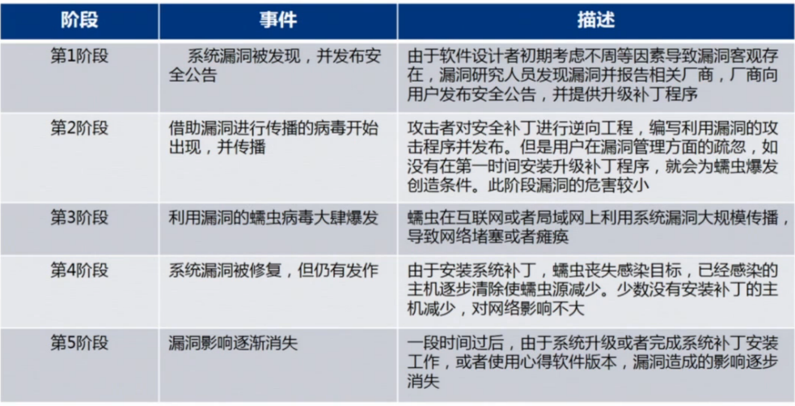

# 操作系统安全防护技术

## 操作系统概述

### 历史

世界上第一台计算机诞生于1946年，20世纪70年代中期开始出现了计算机操作系统。

### 特征

- 并发
- 共享
- 虚拟
- 异步

### 操作系统作用

- 管理系统中各种资源（硬件资源、软件资源）

  - CPU管理
  - 设备管理
  - 存储管理
  - 文件管理
  - 网络与通信管理

- 为用户提供良好的界面

  - 作业控制级接口

    - 联机用户接口
    - 脱机用户接口

  - 程序级接口

### 操作系统分类

按机型分：大、中、小和微型机

按用户数目分：单用户操作系统、多用户操作系统

按功能特征分：批处理操作系统、实时操作系统、分时操作系统

按应用领域分：桌面操作系统（windows、mac os）、服务器操作系统（Centos）、嵌入式操作系统（Android）

## 操作系统安全威胁

### 漏洞

计算机系统在硬件、软件、协议的设计、具体实现以及系统安全策略上存在的缺陷和不足。

### 漏洞的特性

- 漏洞的事件局限性
- 漏洞的广泛性
- 漏洞的隐蔽性
- 漏洞的被发现性

### 漏洞产生的原因

- 程序逻辑结构设计不合理、不严谨
- 除了程序逻辑结构设计漏洞之外，程序设计错误漏洞也是一个重要因素
- 由于目前硬件无法解决特定的问题，使编程人员只能通过软件设计来表现出硬件功能而产生的漏洞

### 漏洞生命周期

漏洞从客观存在到被发现、利用，到大规模危害和逐渐消失，这期间存在一个生命周期，这被称为漏洞生命周期。

### 系统漏洞的防范

- 提升防火墙技术
- 加强病毒防范措施
- 注重漏洞扫描技术的应用
- 强化端口解析以及加强数据备份工作

### 漏洞扫描

漏洞扫描是对计算机系统或其他网络设备进行相关检测，找出安全隐患和可以被攻击者利用的漏洞。

### 漏扫必要性

- 防火墙的局限性和脆弱性
- 针对IDS的逃避技术
- 网络隐患扫描系统浮出水面

### 扫描工具的选择

- 漏洞库中的漏洞数量
- 扫描工具的易用性
- 是否可以生产漏洞报告
- 对于漏洞修复行为的分析和建议
- 安全性
- 工具的性能及价格

### 恶意代码

故意编制或设置的、对网络或系统产生威胁或潜在威胁的计算机代码。

- 木马
- 病毒
- 蠕虫

### 计算机病毒

编制或者在计算机程序中插入的破坏计算机功能或者破坏数据，影响计算机使用并能够自我复制的一组计算机指令或者程序代码。

#### 计算机病毒的特性

- 寄生性
- 传染性
- 潜伏性
- 隐蔽性
- 破坏性
- 可触发性

#### 计算机病毒危害

- 破坏操作系统的处理器管理功能
- 破坏操作系统的文件管理功能
- 破坏操作系统的存储管理功能
- 直接破坏计算机操作系统的硬件功能

#### 防范计算机病毒

- 建立良好的安全习惯
- 关闭或删除系统中不需要的服务
- 经常升级安全补丁
- 使用复杂的密码
- 迅速隔离受感染的计算机
- 最好按照专业的杀毒软件
- 了解一些病毒的知识
- 安装个人防火墙
- 安全管理类软件

### 计算机木马

利用计算机程序漏洞入侵后窃取他人文件、财产与隐私的程序称为木马。计算机木马是一种后门程序，常被黑客用作远程控制计算机的工具。

#### 木马的组成

由硬件部分、软件部分和具体连接部分组成。

#### 木马的传播途径

- 电子邮件
- 下载文件
- 网页传播
- 聊天工具等

#### 木马种类

- 网络游戏木马
- 网银木马
- 即时通讯软件木马
- 网页点击类木马
- 下载类木马
- 代理类木马
- 隐藏类木马
- FTP木马

#### 木马危害

- 盗取网游账号，威胁虚拟财产安全
- 盗取网银信息，威胁真实财产安全
- 后门，使计算机可被控制
- 利用即时通讯软件盗取我们身份，传播木马病毒

#### 木马防范

- 安装杀毒软件和个人防火墙，并及时升级
- 设置好个人防火墙的安全级别
- 使用安全性高的浏览器

### 蠕虫

它利用网络进行复制和传播，途径使网络和电子邮件。

#### 基本程序结构

- 传播模块
  - 扫描模块
  - 攻击模块
  - 复制模块
- 隐藏模块
- 目的功能模块

#### 蠕虫特点

- 较强的独立性
- 利用漏洞主动攻击
- 传播更快更广

#### 蠕虫防护

- 安装杀毒软件、个人防火墙
- 使用安全漏洞扫描软件
- 不浏览不良网页
- 不接收可疑文件和连接

### 端口扫描威胁

端口扫描通常指对目标计算机的所有端口发送同一信息，然后根据返回端口状态来分析目标计算机的端口是否打开或可用。

#### 端口扫描目的

- 判断目标主机上开放的服务
- 反对目标主机的操作系统

### 扫描器

扫描器是一种自动检测远程或本地主机安全性弱点的程序。

## 操作系统安全防护

### 安全防护策略

- 制定操作系统安全策略
- 关闭不必要的服务
- 关闭不必要的端口
- 开启审核策略
- 开启密码策略

### 补丁程序

修复系统漏洞的程序。

#### 补丁分类

- 高危漏洞的补丁
- 软件安全更新的补丁
- 可选的高危漏洞补丁
- 其他及功能性更新补丁
- 无效补丁

### 终端防护软件

指计算机病毒防护软件（病毒防护软件或杀毒软件）

#### 常识

- 杀毒软件不可能查杀所有病毒
- 杀软能查到病毒，但不一定能杀掉
- 一台电脑不必同时安装两个杀毒软件
- 杀毒软件对被感染的文件杀毒有多种方式：1、清除；2、删除；3、禁止访问；4、隔离；5、不处理

### 个人防火墙

不需要特定的网络设备，用户在计算机上安装即可，可以设置特定的规则组织来自外部网络的攻击保护操作系统的安全。

#### 防火墙功能

- 过滤不安全的服务和非法用户，防止未授权的用户访问内部网络。
- 能控制对内部网络的访问权，根据用户的安全策略，允许内部网络一部分主机被外部访问。
- 能对网络安全进行监控

#### 

