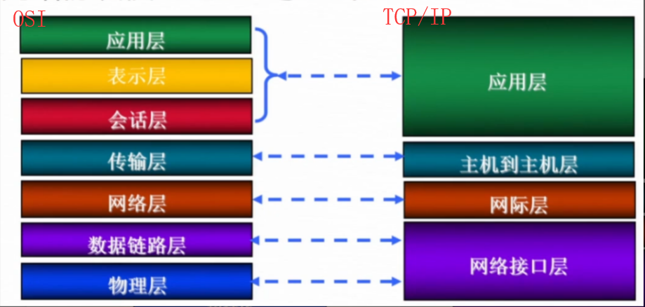
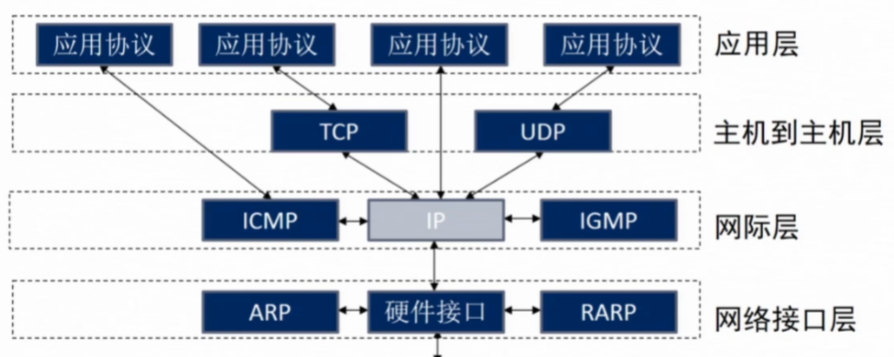
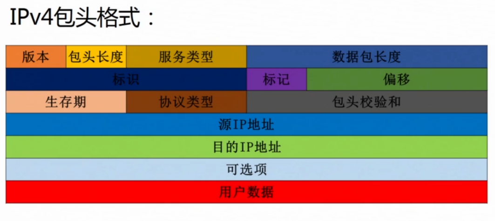
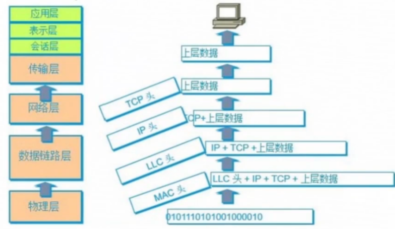
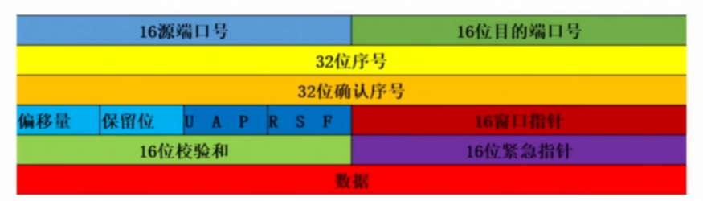
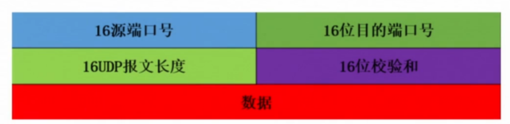

# 网络安全防护技术

## 网络基础知识

### Internet和TCP/IP协议

因特网(Internet)通过TCP/IP协议将遍布全世界各地的计算机互联，而形成超级计算机网络。

### 网络协议模型（OSI与TCP/IP）

### TCP/IP协议分层

### 通信地址

- 通信就是将数据从一端传送到另一端的过程。在网络中，寄出地址位源地址，寄到地址为目的地址。
- 通信中，每台计算机必须有一个全球唯一的物理地址
- MAC地址（48bit）在网络接口层
- 通信中，每台计算机还必须有一个逻辑地址，这个逻辑地址在IP层被称为IP地址（32bit）

### IP地址分类

#### ipv4

- 被分为A、B、C、D、E五类

- 32位

- 数据包长度：Ipv4包头长度+Ipv4用户数据长度

- 标示：分片重组时保持一致

- 标记：第二bit置1，表示不能分片；第三bit置1，表示最后一片

- 偏移：分片重组时还原原始数据位置

- 生存期：没经过一跳此数值减一，避免数据平面环路导致的无限转发

#### ipv6

- 128位

### 封装和解封装

#### 封装（Encapsulation）

- 当高层进程要进行数据传送时，会先将数据从高层向低层传送
- 经过低层时，会分别加上该低层的头部信息置于数据首部

#### 解封装（Decapsulation）

执行封装的逆过程

### 端口

计算机中有一些协议常用端口，这些端口绑定了一些服务且明确表示使用某种服务协议。

范围是0~65535。

### TCP与UDP

#### 传输控制协议TCP

- 提供面向连接的、可靠的字节流服务
- 提供可靠性服务

#### 用户数据报协议UDP

- 提供面向事务的简单不可靠消息传送服务
- 无连接、不可靠。
- 协议简单、占用资源少，效率高

### 万维网(www)

用户可疑通过浏览器访问服务端程序提供的页面。

### 超文本标记语言HTML

- 超文本标记语言HTML是一种制作万维网的标准语言
- 为不同计算机交换信息资源提供了统一的格式
- 将各种不同格式的对象（文本、图形、音频等）组织在一个一个的网页中
- 后缀为htm、html

### 超文本传输协议HTTP

是用于从www服务器传输超文本到本地浏览器的传输协议。

### 统一资源定位符URL

为了获取特定的信息资源，需要给出资源的地址即统一资源定位符。它是用来标识万维网中每个信息资源的地址。

#### URL组成

`http://主机域名或者IP地址[:端口]/文件路径/文件名`

## 网络安全威胁

网络安全威胁主要来自攻击者和网络及信息系统的攻击。

攻击者可以通过网络嗅探、网络钓鱼、拒绝服务、远程控制、社会工程学等网络攻击手段，获得目标计算机的控制权，或获取有价值的数据和信息等。

### 网络嗅探

通过截获、分析网络中传输的数据而获取有用信息的行为。

### 网络钓鱼

攻击者利用伪造的网站或欺骗性的电子邮件进行的网络诈骗活动。

#### 网络钓鱼常用手段

- 伪造相似域名的网站
- 显示IP地址而非域名
- 超链接欺骗
- 弹窗欺骗

### 拒绝服务攻击

拒绝服务攻击（DoS）

分布式拒绝服务攻击（DDoS）

同步泛洪攻击（SYN flooding）

### 远程控制

通过各种非法手段成功入侵目标主机后，以实现对目标主机的远程控制

### 社会工程学

运用信息搜集，语言技巧、心理陷阱等多种手段，完成欺骗目的的方法

## 网络安全防护与实践

### 虚拟专有网络(VPN)

VPN是在公有网络上建立专有网络的技术。

#### 特点

- 成本高
- 安全性高
- 服务质量保证
- 可管理性
- 可扩展性

#### 常用协议

- IPSec协议
- 安全套接字协议SSL

#### 应用

- 远程访问VPN：企业内部人员流动频繁或远程办公
- 内联网VPN：相同企业内部异地互联
- 外联网VPN：不同企业之间互联

### 防火墙

设置在不同网络之间的一系列包括软硬件在内的部件组合。它在内网和外网之间构建一道保护屏障，网络内部与外部之间的所有数据必须经过防火墙，只有符合安全标准的数据流才能通过防火墙。

#### 功能

- 数据包过滤
- 审计和报警机制
- 远程管理
- 网络地址转换
- 代理
- 流量控制、统计分析和流量计费

## 无线局域网安全防护

### 增强安全的措施

1、修改admin密码

2、使用无线网络安全协议

3、禁用DHCP服务

4、禁止SSID广播

5、禁止远程管理

6、MAC地址过滤

7、合理放置无线AP

